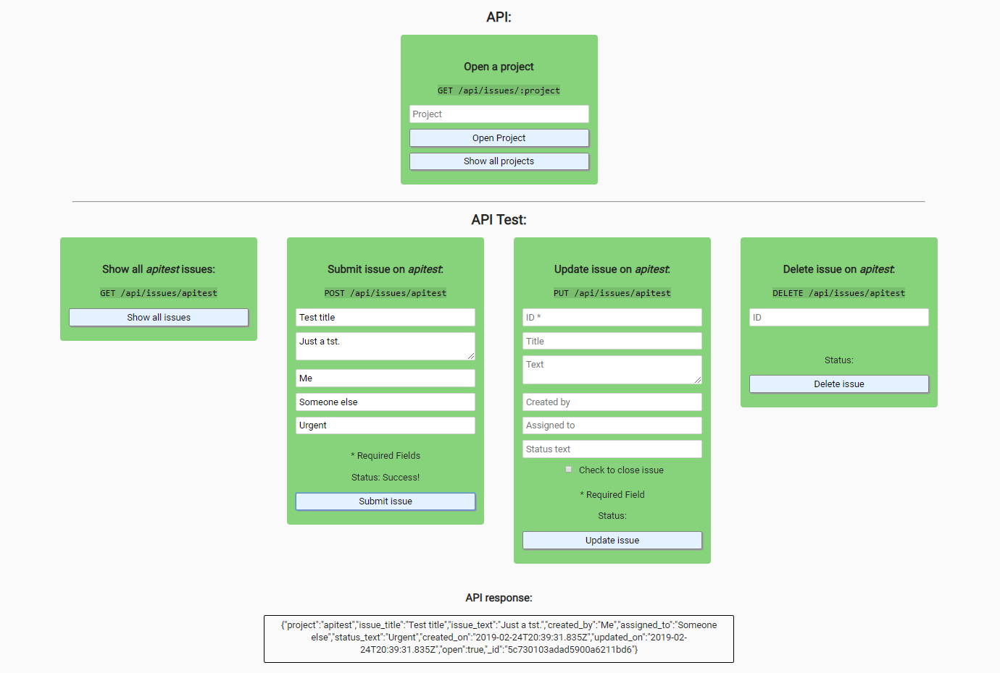

# Issue Tracker

## Introduction
An issue tracker that lets users create issues for a project.  
The issue details can be updated and an issue can be marked as closed or deleted all together.

Testing is done with Chai.

This project is part of freeCodeCamps Information Security and Quality Assurance certificate.

***

## Project Requirements
* Cross site scripting (XSS attack) is prevented.
* It is possible to POST /api/issues/{project} with form data containing required issue_title, issue_text, created_by, and optional assigned_to and status_text.
* The object saved (and returned) will include all of those fields (blank for optional no input) and also include created_on (date/time), updated_on (date/time), open (boolean, true for open, false for closed), and _id.
* Ii is possible to PUT /api/issues/{project} with an _id and form data to update the object. Returned will be 'successfully updated' or 'could not update '+_id. This should always update updated_on. If no fields are sent return 'no updated field sent'.
* It is possible to DELETE /api/issues/{project} with an _id to completely delete an issue. If no _id is sent return '_id error', on success return 'deleted '+_id and on fail return 'could not delete '+_id.
* It is possible to GET /api/issues/{project} for an array of all issues on that specific project with all the information for each issue as was returned when posted.
* It is possbile to filter my GET request by also passing along any field and value in the query (i.e. /api/issues/{project}?open=false). I can pass along as many fields/values as I want.
* All 11 functional tests are complete and passing.

***

## Final Project
https://fcc-infosec-issue-tracker-fred.glitch.me

***

## Behind the scenes
### Backend:
* Node
* Express
* Mongodb
* Helmet
* Chai

### Database:
* MongoDB

### Hosting:
* Glitch
* mLab

***

## Preview Images
### Main Screen:

